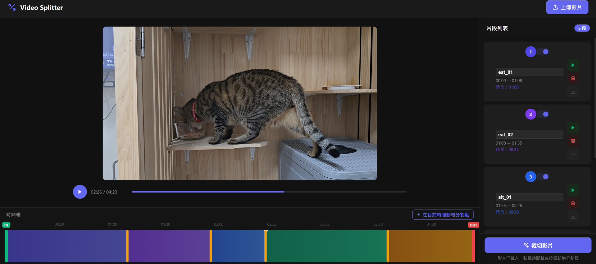

# ClipForge

> A lightweight browser-based video splitting tool — upload, mark split points on an interactive timeline, name each segment, and download the results.


---



---

## ✨ Features

### Video Upload & Preview
- Upload local video files: **MP4, MOV, AVI, MKV, WebM**
- Instant in-browser preview with standard play/pause controls
- Progress bar with click-to-seek support

### Interactive Timeline
- Visual colour-coded segment regions on the timeline
- **Add split points** at the current playback position (button) or by clicking anywhere on the timeline
- **Drag split markers** left/right to fine-tune cut positions — the video frame updates live while dragging so you can see exactly where you are cutting
- **IN / OUT trim handles** (green = IN, red = OUT) — the exported segments only cover the selected range, the full video does not have to start from 0 s
- Minimum 1 s gap enforced between all markers to prevent overlaps
- Z-index layering: split markers (35) sit above trim handles (25) to avoid accidental clicks

### Segment Management (right panel)
| Feature | Detail |
|---------|--------|
| **Custom segment names** | Each segment has an editable name field; the name becomes the output filename |
| **Enable / Disable toggle** | Disabled segments are excluded from the split operation; the card dims to indicate inactive state |
| **Per-segment play button** | Plays only that segment's time range and stops automatically at the end |
| **Delete segment** | Removes the adjacent split point and merges the segment with its neighbour |
| **Download button** | Activated after splitting; downloads the processed MP4 directly |

### Split & Export
- Backend splits via **FFmpeg** (`libx264` + `aac`) — fast, lossless-quality re-encode
- Disabled segments produce a placeholder so download button indices stay aligned
- Output filenames are sanitised (illegal characters replaced) to be safe on all OS

### Stale-state Safety
- `cancelResume()` clears any pending play-resume timers when a new video is uploaded, preventing stale callbacks from corrupting the new session

---

## 🚀 Quick Start

### Option A — Docker Compose (recommended)

```bash
# Clone the repo
git clone https://github.com/acer1204/ClipForge.git
cd ClipForge

# Build and start (port 6621)
docker compose up -d --build

# Open in browser
http://localhost:6621
```

### Option B — Local Python

**Prerequisites:** Python 3.10+, FFmpeg installed and on PATH

```bash
git clone https://github.com/acer1204/ClipForge.git
cd ClipForge

python -m venv .venv
# Windows
.venv\Scripts\activate
# Linux / macOS
source .venv/bin/activate

pip install -r requirements.txt
python app.py
# Open http://localhost:5000
```

---

## 🐳 Docker Details

```yaml
# docker-compose.yml (simplified)
ports:
  - "6621:5000"   # host:container
volumes:
  - uploads:/app/uploads   # named volume — persists across restarts
  - outputs:/app/outputs
```

### Bind mount to a local folder (optional)

**Windows**
```yaml
volumes:
  - "C:/Users/<you>/ClipForge/uploads:/app/uploads"
  - "C:/Users/<you>/ClipForge/outputs:/app/outputs"
```

**Ubuntu / Linux / macOS**
```yaml
volumes:
  - ./uploads:/app/uploads
  - ./outputs:/app/outputs
```

> Remove the `volumes:` block at the bottom of the file when switching to bind mounts.

### Common commands
```bash
docker compose up -d          # start in background
docker compose logs -f        # stream logs
docker compose down           # stop and remove containers
docker compose down -v        # also delete named volumes (clears all uploaded/output files)
docker compose up -d --build  # rebuild image after code changes
```

---

## 🗂 Project Structure

```
ClipForge/
├── app.py              # Flask backend — upload, serve, split endpoints
├── index.html          # Single-page frontend (vanilla JS, no framework)
├── requirements.txt    # Python dependencies (Flask)
├── Dockerfile          # python:3.12-slim + ffmpeg
├── docker-compose.yml  # Port 6621, named volumes
└── README.md
```

---

## 🔧 API Endpoints

| Method | Path | Description |
|--------|------|-------------|
| `GET` | `/` | Serve the frontend |
| `POST` | `/upload` | Accept video file, return `{filename, duration}` |
| `GET` | `/video/<filename>` | Stream the uploaded video (range-request support) |
| `POST` | `/split` | Run FFmpeg split, return segment list with sizes |
| `GET` | `/output/<filename>` | Download a processed segment |

---

## 📋 Requirements

| Dependency | Version |
|------------|---------|
| Python | ≥ 3.10 |
| Flask | ≥ 3.0 |
| FFmpeg | any recent |
| Docker + Compose | optional |

---

---

# ClipForge（中文說明）

> 輕量級網頁影片分割工具 — 上傳影片、在互動時間軸上標記分割點、為每個片段命名，最後下載輸出結果。

---


---

## ✨ 功能說明

### 影片上傳與預覽
- 支援本機影片格式：**MP4、MOV、AVI、MKV、WebM**
- 上傳後立即在瀏覽器內預覽，支援播放/暫停控制
- 進度條可直接點擊跳轉至任意時間點

### 互動時間軸
- 以不同顏色區塊視覺化顯示各片段範圍
- **新增分割點**：可點擊「在目前時間新增分割點」按鈕，或直接點擊時間軸任意位置
- **拖動分割標記**：左右拖動可精確調整切割位置，拖動時上方影片畫面會同步更新，讓你清楚看到當下的畫面
- **IN / OUT 修剪把手**（綠色 = 起點、紅色 = 終點）：輸出片段只涵蓋選定範圍，不強制從 0 秒開始
- 所有標記之間強制保持最少 1 秒間距，避免重疊
- Z-index 分層設計：分割標記 (35) 覆蓋於修剪把手 (25) 之上，防止誤觸

### 片段管理（右側面板）
| 功能 | 說明 |
|------|------|
| **自訂片段名稱** | 每個片段均有可編輯的名稱欄位，名稱即為輸出檔名 |
| **啟用 / 停用開關** | 關閉的片段在裁切時會跳過，卡片會變暗表示非作用中狀態 |
| **片段播放按鈕** | 僅播放該片段的時間範圍，到達終點自動停止 |
| **刪除片段** | 移除相鄰的分割點，與鄰近片段合併 |
| **下載按鈕** | 裁切完成後啟用，直接下載該片段的 MP4 檔案 |

### 分割與輸出
- 後端使用 **FFmpeg** 進行分割（`libx264` + `aac`）— 快速、高畫質重編碼
- 停用的片段會回傳佔位符，確保下載按鈕的索引與畫面對齊
- 輸出檔名自動過濾非法字元，相容於各作業系統

### 狀態安全機制
- 上傳新影片時會呼叫 `cancelResume()`，清除前一個影片殘留的播放計時器，防止舊回呼影響新影片操作

---

## 🚀 快速開始

### 方式 A — Docker Compose（推薦）

```bash
git clone https://github.com/acer1204/ClipForge.git
cd ClipForge

# 建構並啟動（連接埠 6621）
docker compose up -d --build

# 瀏覽器開啟
http://localhost:6621
```

### 方式 B — 本機 Python 執行

**前置需求：** Python 3.10+、FFmpeg 已安裝並加入 PATH

```bash
git clone https://github.com/acer1204/ClipForge.git
cd ClipForge

python -m venv .venv
# Windows
.venv\Scripts\activate
# Linux / macOS
source .venv/bin/activate

pip install -r requirements.txt
python app.py
# 開啟 http://localhost:5000
```

---

## 🐳 Docker 說明

### 掛載本機資料夾（選用）

**Windows**
```yaml
volumes:
  - "C:/Users/<帳號>/ClipForge/uploads:/app/uploads"
  - "C:/Users/<帳號>/ClipForge/outputs:/app/outputs"
```

**Ubuntu / Linux / macOS**
```yaml
volumes:
  - ./uploads:/app/uploads
  - ./outputs:/app/outputs
```

> 改用本機路徑掛載時，請將 `docker-compose.yml` 底部的 `volumes:` 定義區塊刪除。

### 常用指令
```bash
docker compose up -d           # 背景啟動
docker compose logs -f         # 即時查看 log
docker compose down            # 停止並移除容器
docker compose down -v         # 同時刪除 named volume（清除所有影片資料）
docker compose up -d --build   # 程式碼修改後重新建構
```

---

## 🗂 專案結構

```
ClipForge/
├── app.py              # Flask 後端 — 上傳、影片串流、分割
├── index.html          # 單頁前端（原生 JS，無框架）
├── requirements.txt    # Python 相依套件（Flask）
├── Dockerfile          # python:3.12-slim + ffmpeg
├── docker-compose.yml  # 連接埠 6621，named volume
└── README.md
```

---

## 🔧 API 端點

| 方法 | 路徑 | 說明 |
|------|------|------|
| `GET` | `/` | 回傳前端頁面 |
| `POST` | `/upload` | 接收影片檔案，回傳 `{filename, duration}` |
| `GET` | `/video/<filename>` | 串流上傳的影片（支援 Range Request） |
| `POST` | `/split` | 執行 FFmpeg 分割，回傳片段清單與檔案大小 |
| `GET` | `/output/<filename>` | 下載已處理的片段 |
